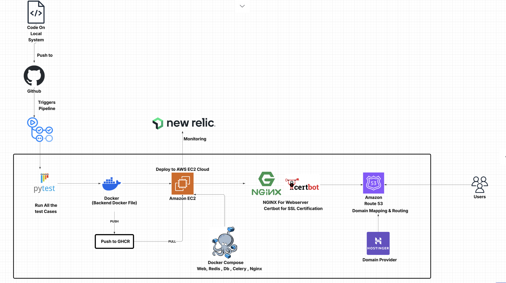

# Deployment

TaskVault is deployed using a modern containerized workflow on AWS.

# Architecture Flowchart

## Deployment Workflow
- **CI/CD**: GitHub Actions handles the automated testing and deployment pipeline.
- **Containerization**: Docker is used for consistent environments across development and production.
- **Registry**: Docker images are built and pushed to GitHub Container Registry (GHCR).
- **Production Server**: AWS EC2 instance running Ubuntu.
- **Orchestration**: Docker Compose manages multiple services (Gunicorn, Postgres, Redis, Celery, Nginx).
- **Security**: Nginx serves as a reverse proxy with automated SSL certificate management via Certbot.

## Tools Used
- **GitHub**
- **GitHub Actions**
- **Docker & Docker Compose**
- **AWS EC2**
- **AWS Route 53**
- **Nginx**
- **Certbot**
- **Gunicorn**
- **Celery**
- **Redis**
- **PostgreSQL**

