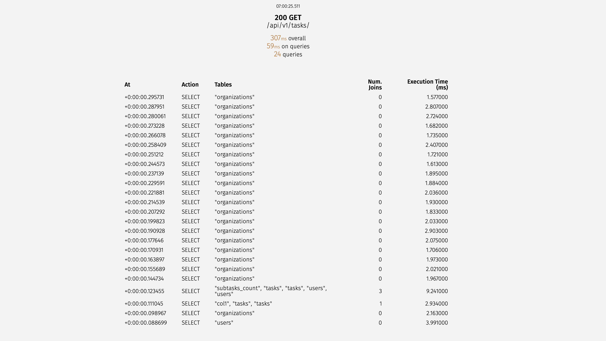
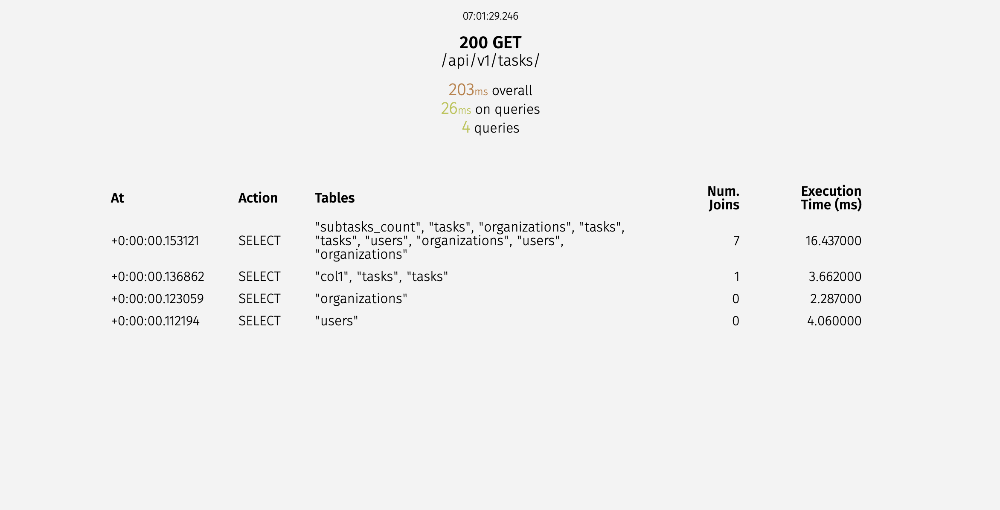
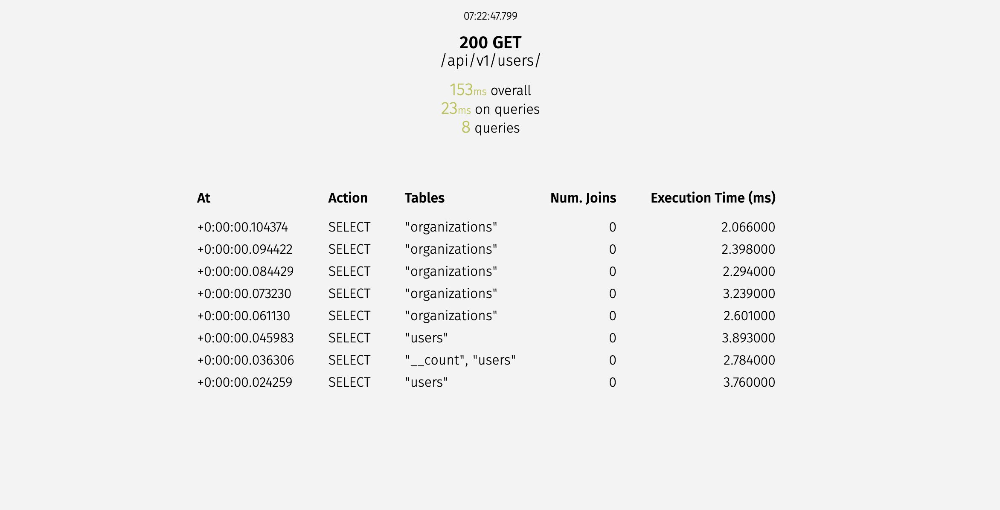
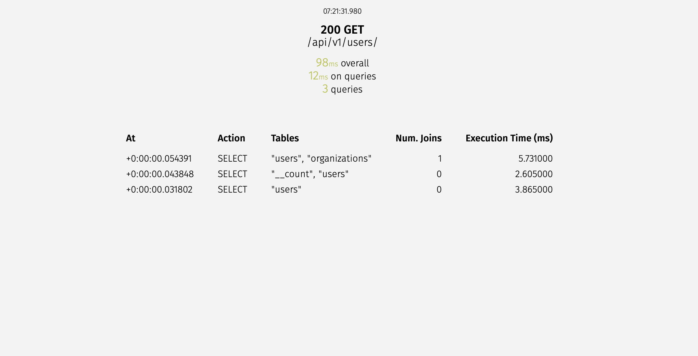
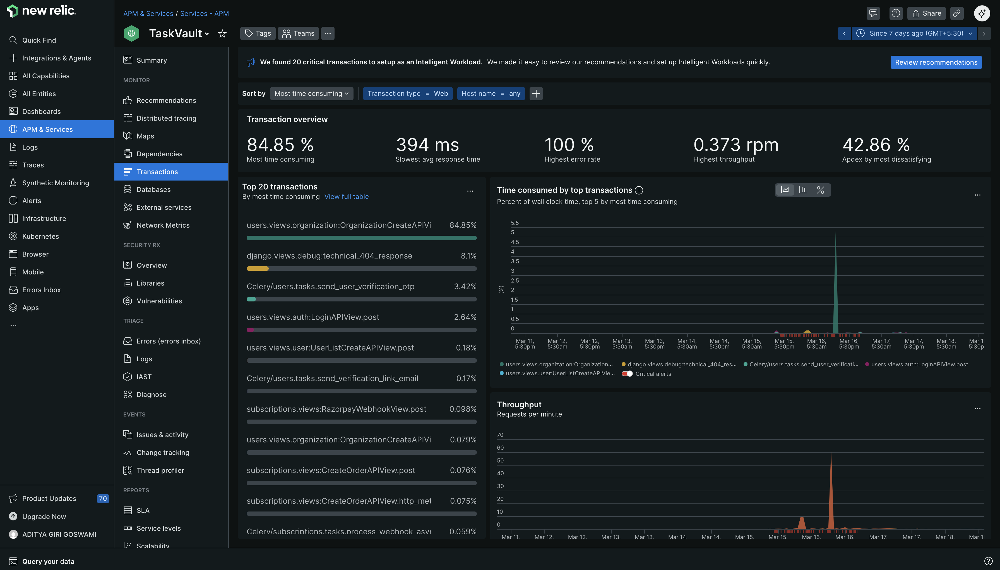

# Optimization and Monitoring

Performance and stability are key priorities for TaskVault. We use a suite of tools to profile, optimize, and monitor the application.

## Toolset
- **Pyinstrument**: A low-overhead Python profiler used to identify bottlenecks in the request lifecycle and slow code paths.
- **Locust**: Used for high-concurrency load testing.
- **Django-Silk**: An interactive query profiler to catch N+1 queries and SQL issues in development.
- **New Relic**: Production APM for real-time metrics, error tracking, and performance monitoring across Django and EC2 infrastructure.

## Performance Optimizations
- **Query Optimization**: Resolved N+1 query issues using `select_related` and `prefetch_related` across high-traffic APIs (Tasks, Users, and Subscription).
- **Password Hashing**: Replaced Django default hasher with Argon2 (`argon2-cffi`) for stronger password hashing and reduced CPU overhead in auth flows.
- **Caching & Response Time**: Added Redis-backed caching for frequently accessed endpoints and reduced average API response latency.

## Argon2 Password Hashing Before/After
We profiled CPU time before and after switching to Argon2 using Pyinstrument. Compare the result pages below.

- [Before Optimization](pyinstrument/before_passhash.html)
- [After ](pyinstrument/after_passhash.html)

### Profiling report (before)
<iframe src="../pyinstrument/before_passhash.html" style="width:100%;height:650px;border:1px solid #ccc;"></iframe>

### Profiling report (after)
<iframe src="../pyinstrument/after_passhash.html" style="width:100%;height:650px;border:1px solid #ccc;"></iframe>

## Django-Silk: N+1 Query Optimization
### Task List API Optimization
**Objective:** Resolve N+1 bottleneck in `GET /api/v1/tasks/`.

**Problem:** For each task, separate queries were executed to fetch related `owner`, `assignee`, and organization data.

**Solution:** Use deep `select_related` in the queryset:

```python
queryset = Task.objects.select_related(
    "owner",
    "assignee",
    "parent_task",
    "organization",
    "owner__organization",
    "assignee__organization",
)
```

**Impact:** Query count reduced from 20+ (linear) to 4-5 stable queries (constant overhead).

- Task List API Sql Queries before optimization


- Task List API Sql Queries after optimization


### User List API Optimization
**Objective:** Eliminate N+1 on `GET /api/v1/users/`.

**Problem:** Each user row executed an extra query for organization details.

**Solution:** Use:

```python
qs = User.objects.select_related("organization").all()
```

**Impact:** Query count became constant (1 query), reducing latency and DB load.

- User List API Sql Queries before optimization


- User List API Sql Queries after optimization


## Locust Load Testing Analysis
We analyzed two Locust reports:

1. **hundred_user.html**: 100 users, ramp up 10 users per second
2. **more_than_hundred.html**: 1000 users, ramp up 10 users per second

### Report Summary
- **100 users (slow ramp)**: Stable throughput with average response times typically within acceptable bounds; low failure rate; indicates system can handle baseline traffic.
- **1000 users (faster ramp)**: High throughput but increased latency and potential timeouts under peak load; useful to identify bottlenecks in DB query handling and worker concurrency.

### Embedded reports
#### 100-user report
<iframe src="../locust/hundred_user.html" style="width:100%;height:700px;border:1px solid #ccc;"></iframe>

#### 1000-user report
<iframe src="../locust/more_than_hundred.html" style="width:100%;height:700px;border:1px solid #ccc;"></iframe>

## New Relic Monitoring
We use New Relic for full-stack observability: APM, error tracking, transaction tracing, and real-time dashboards.

- **Dashboard**: We monitor CPU, memory, throughput, and key transaction times.
- **Alerts**: Real-time alerts on error rate spikes and slow endpoints.
- **APM Traces**: Deep stack traces for slow requests and database query timing.



## Optimization Techniques
We implement several layers of optimization across the stack:

- **Database Indexing**: Ensuring UUID paths and frequently queried fields are indexed.
- **Query Optimization**: Using `select_related` and `prefetch_related` to solve N+1 structural problems.
- **Redis Cache**: Performance boost for high-traffic catalog data by caching response.
- **Background Processing**: Offloading heavy tasks (like email and payment reconciliation) to **Celery**.
